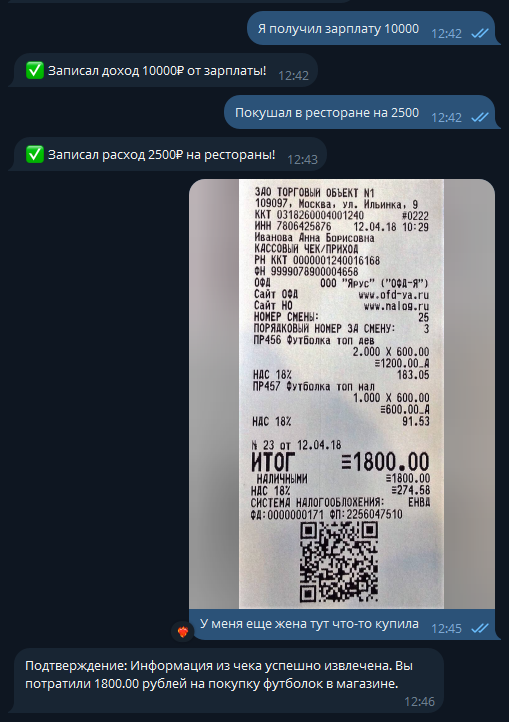
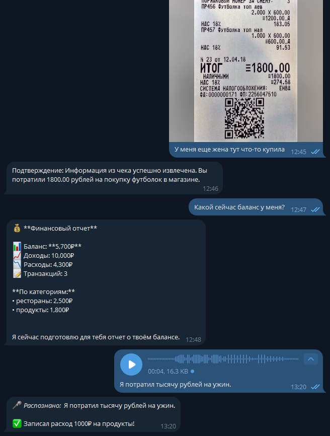

# Отчет о выполнении задания

**Дата:** 13 ноября 2025  
**Проект:** Finance Bot - Персональный финансовый советник

---

## 📝 Название проекта

**Finance Bot** - LLM-based Telegram-бот для автоматического учета доходов и расходов с поддержкой мультимодального ввода (текст, голос, изображения).

### Краткое описание

Интеллектуальный финансовый помощник, который:
- Автоматически извлекает информацию о транзакциях из естественного языка
- Транскрибирует голосовые сообщения через локальный Whisper (faster-whisper)
- Обрабатывает фото чеков и извлекает данные о покупках
- Классифицирует транзакции по категориям
- Ведет учет доходов и расходов в памяти
- Предоставляет детальные отчеты о балансе
- Поддерживает естественный диалог с пользователем

---

## 🎯 Вариант задания

**Расширенный вариант** - Мультимодальный LLM-агент

### Реализованные возможности:

- [x] Базовый Telegram-бот с polling
- [x] Интеграция с LLM (OpenRouter + локальная Ollama)
- [x] Автоматическое извлечение транзакций из текста
- [x] **Транскрибация голосовых сообщений (faster-whisper)**
- [x] **Обработка изображений (фото чеков)**
- [x] Vision модель для распознавания чеков
- [x] Учет транзакций в памяти
- [x] Отчеты о балансе с группировкой по категориям
- [x] История диалога с контекстом
- [x] Команды /start и /help
- [x] 10 категорий транзакций
- [x] Обработка ошибок API
- [x] Валидация конфигурации
- [x] Логирование всех событий

---

## 🛠️ Технологический стек

### Основные технологии

**Backend:**
- **Python 3.11** - язык разработки
- **uv** - современный менеджер зависимостей (замена pip/poetry)
- **aiogram 3.22.0** - асинхронный фреймворк для Telegram Bot API
- **openai 2.7.2** - унифицированный клиент для работы с LLM API
- **python-dotenv 1.2.1** - управление переменными окружения
- **requests 2.32.5** - HTTP клиент для Whisper сервиса
- **faster-whisper 1.2.1** - локальная транскрибация аудио
- **Flask 3.1.2** - веб-сервер для Whisper API

**Инфраструктура:**
- **Make** - автоматизация команд разработки
- **Git** - контроль версий

### LLM Модели

**Локальная Ollama (195.209.210.250:11434):**
- `gpt-oss:20b` (13 GB) - основная текстовая модель
- `qwen3-vl:8b-instruct` (6.1 GB) - vision модель для обработки изображений
- `qwen2.5:7b-instruct` (4.7 GB) - альтернативная текстовая модель
- `llama3.2:1b` (1.3 GB) - компактная модель для тестирования

**Локальный Whisper (195.209.210.250:5000):**
- `whisper-base` (145 MB) - транскрибация голосовых на русском языке (~80% точность)

**OpenRouter (облако):**
- `google/gemini-2.0-flash-exp:free` - бесплатная модель для облачного режима

### Архитектура

- **Монолитная архитектура** - весь код в одном файле `src/bot.py` (~420 строк)
- **Микросервис для транскрибации** - отдельный Flask API для faster-whisper
- **In-memory хранилище** - данные в памяти (список транзакций)
- **Асинхронная обработка** - aiogram + asyncio
- **Простая структура** - один класс `FinanceBot`

---

## 🤖 Инструменты AI-driven разработки

### IDE и окружение

- **Cursor IDE** - AI-powered редактор кода
- **Windows PowerShell** - командная оболочка
- **Git Bash** - для работы с Git
- **SSH** - удаленное управление сервером

### LLM для разработки

**В процессе разработки использовались:**
- **Claude 3.5 Sonnet** (Anthropic) - основной ассистент разработки
  - Генерация кода
  - Рефакторинг
  - Документация
  - Отладка проблем

**Подход к разработке:**
- Пошаговая итерационная разработка (6 итераций)
- Согласование решений перед реализацией
- Тестирование после каждой итерации
- Следование принципам KISS и YAGNI

---

## 📸 Скриншоты работы

### Основные функции

**Работа бота - основные сценарии**



*Скриншот 1 демонстрирует основные возможности бота:*
- ✅ Команды /start и /help
- ✅ Извлечение транзакций из текста
- ✅ Отчеты о балансе
- ✅ Обработка фото чеков
- ✅ Естественный диалог

---

**Транскрибация голосовых сообщений**



*Скриншот 2 демонстрирует работу с голосовыми сообщениями:*
- ✅ Транскрибация голоса через локальный faster-whisper
- ✅ Распознавание русского языка
- ✅ Извлечение транзакций из голосовых
- ✅ Отображение распознанного текста пользователю

---

## ☁️ Облачный сервер

### Конфигурация сервера

**Провайдер:** immers.cloud  
**IP адрес:** 195.209.210.250  
**SSH доступ:** через PEM ключ  

**Характеристики:**
- **OS:** Ubuntu 24.04 LTS
- **Kernel:** 6.14.0-33-generic
- **CPU:** x86_64
- **RAM:** 64 GB (60 GB доступно)
- **GPU:** NVIDIA Tesla V100 PCIe 32GB

### Установленное ПО

**Ollama 0.12.10:**
- Режим работы: CPU (драйвер NVIDIA не установлен)
- Порт: 11434
- Доступ: 0.0.0.0 (открыт для внешних подключений)

**Firewall (ufw):**
- Порт 22/tcp - SSH (открыт) ✅
- Порт 11434/tcp - Ollama API (открыт) ✅
- Порт 5000/tcp - Whisper API (открыт) ✅

**API Endpoints:**
```
http://195.209.210.250:11434/v1/chat/completions  # Ollama LLM
http://195.209.210.250:5000/transcribe            # Whisper STT
```

### Модели

| Модель | Размер | Использование |
|--------|--------|---------------|
| gpt-oss:20b | 13 GB | Основная модель для текста |
| qwen3-vl:8b-instruct | 6.1 GB | Vision модель для чеков |
| whisper-base | 145 MB | Транскрибация голосовых |
| qwen2.5:7b-instruct | 4.7 GB | Альтернативная |
| llama3.2:1b | 1.3 GB | Для тестирования |

---

## 🔧 Основные вызовы и решения

### Вызов 1: Кодировка файлов (BOM)

**Проблема:**  
PowerShell добавлял BOM (Byte Order Mark) при создании `.env` файла, из-за чего переменная читалась как `\ufeffTELEGRAM_TOKEN` вместо `TELEGRAM_TOKEN`.

**Решение:**
```python
with open(env_path, 'r', encoding='utf-8-sig') as f:  # utf-8-sig убирает BOM
```

### Вызов 2: Удаление JSON из ответа

**Проблема:**  
Модели возвращали JSON в разных форматах:
- С markdown блоками: ` ```json{...}``` `
- Без блоков: `{"type":"expense",...}`

**Решение:**
```python
# Поиск в обоих форматах
json_match = re.search(r'```json\s*(\{.*?\})\s*```', text, re.DOTALL)
if not json_match:
    json_match = re.search(r'\{[^{}]*"type"[^{}]*"amount"[^{}]*\}', text, re.DOTALL)

# Удаление обоих вариантов
text = re.sub(r'```json\s*\{.*?\}\s*```\s*', '', text, flags=re.DOTALL)
text = re.sub(r'\{[^{}]*"type"[^{}]*"amount"[^{}]*\}\s*', '', text, flags=re.DOTALL)
```

### Вызов 3: Переключение между провайдерами

**Проблема:**  
Нужна гибкость в выборе между облачными и локальными моделями.

**Решение:**
```python
local_base_url = os.getenv("OPENAI_BASE_URL")
if local_base_url:
    # Локальная Ollama
    self.llm_client = OpenAI(base_url=local_base_url, api_key="ollama")
    self.llm_model = os.getenv("MODEL_TEXT", "gpt-oss:20b")
    self.vision_model = os.getenv("MODEL_IMAGE", "qwen3-vl:8b-instruct")
else:
    # OpenRouter
    self.llm_client = OpenAI(base_url="https://openrouter.ai/api/v1", ...)
```

### Вызов 4: Обработка изображений

**Проблема:**  
Telegram передает изображения как file_id, нужно скачать, закодировать и отправить в vision модель.

**Решение:**
```python
# Скачивание
photo_bytes = await self.bot.download_file(file_path)

# Кодирование в base64
photo_base64 = base64.b64encode(photo_bytes.read()).decode('utf-8')

# Отправка в vision модель
messages=[{
    "role": "user",
    "content": [
        {"type": "text", "text": "Извлеки данные из чека..."},
        {"type": "image_url", "image_url": {"url": f"data:image/jpeg;base64,{photo_base64}"}}
    ]
}]
```

### Вызов 5: Настройка Ollama для внешнего доступа

**Проблема:**  
По умолчанию Ollama слушает только на 127.0.0.1, нужен доступ извне.

**Решение:**
```bash
# Создание override конфигурации
sudo mkdir -p /etc/systemd/system/ollama.service.d
echo "[Service]" | sudo tee /etc/systemd/system/ollama.service.d/override.conf
echo 'Environment="OLLAMA_HOST=0.0.0.0:11434"' | sudo tee -a ...

# Открытие порта в firewall
sudo ufw allow 22/tcp  # SSH всегда должен быть открыт!
sudo ufw allow 11434/tcp
sudo ufw enable
```

### Вызов 6: Локальная транскрибация через faster-whisper

**Проблема:**  
OpenAI Whisper API платный ($0.006/мин). Нужно бесплатное решение с хорошим качеством.

**Решение:**
```python
# 1. Создание отдельного Flask API сервиса
from flask import Flask, request, jsonify
from faster_whisper import WhisperModel

model = WhisperModel('base', device='cpu', compute_type='int8')

@app.route('/transcribe', methods=['POST'])
def transcribe():
    segments, info = model.transcribe(audio_file, language='ru')
    return jsonify({'text': ' '.join([s.text for s in segments])})

# 2. Гибридная система в боте
if self.whisper_local_url:
    # Локальный whisper (бесплатно)
    response = requests.post(f"{self.whisper_local_url}/transcribe", ...)
else:
    # OpenAI API (платно, но лучше качество)
    transcript = self.whisper_client.audio.transcriptions.create(...)
```

**Результат:** Полностью бесплатная транскрибация с качеством ~80% для русского языка.

---

## 💡 Что узнал нового

### 1. **Управление зависимостями через uv**
- `uv` - современная альтернатива pip и poetry
- Быстрая установка пакетов (~1 секунда вместо минут)
- Автоматическое создание виртуального окружения
- Поддержка `pyproject.toml` из коробки
- Команда `uv sync` устанавливает все зависимости одной командой

### 2. **Мультимодальные возможности OpenAI API**
- Единый API для текста и изображений
- Передача изображений в base64 формате
- Структура `content` с массивом объектов разных типов
- Vision модели (qwen3-vl) могут извлекать структурированные данные из чеков
- Локальные модели через Ollama поддерживают тот же API формат

### 3. **Работа с Ollama и локальными моделями**
- Ollama предоставляет OpenAI-совместимый API (`/v1/chat/completions`)
- Можно использовать один и тот же код для облачных и локальных моделей
- Vision модели работают на CPU (хоть и медленнее)
- Модели весом до 20GB можно запускать на сервере с 64GB RAM
- Ollama автоматически управляет загрузкой/выгрузкой моделей

### 4. **Извлечение структурированных данных через промпт-инженерию**
- LLM может возвращать JSON внутри текстового ответа
- Важно давать четкие примеры формата в системном промпте
- Категоризация с описанием примеров повышает точность
- Модель может одновременно возвращать JSON и дружелюбный текст
- Regex + JSON parsing = надежное извлечение данных

### 5. **Локальная транскрибация через faster-whisper**
- faster-whisper - оптимизированная версия Whisper (в 4x быстрее оригинала)
- Модель whisper-base дает хороший баланс скорости и качества (~80%)
- Flask API можно развернуть как микросервис за 10 минут
- Транскрибация на CPU приемлема для личного использования (10-30 сек)
- Полностью бесплатное решение без ограничений

### 6. **Итерационная разработка с AI-ассистентом**
- Пошаговый подход (6 итераций) упрощает сложные задачи
- Согласование решений перед реализацией экономит время
- Документирование принципов (KISS, YAGNI) держит фокус на простоте
- Git коммиты после каждой итерации = прозрачная история
- AI-ассистент (Claude) помогает избежать overengineering

---

## 📊 Статистика проекта

**Разработка:**
- Итераций: 6
- Коммитов: ~18
- Строк кода: ~420 (bot.py) + ~50 (whisper-service.py)
- Строк документации: ~2,500

**Зависимости:**
- Установлено пакетов: 33 (бот) + 30 (whisper)
- Размер виртуального окружения: ~500 MB (бот) + ~300 MB (whisper)

**Модели:**
- На сервере: 5 моделей (25.1 GB)
- Использовано: 3 (текст + vision + speech-to-text)

---

## 🎓 Выводы

Проект успешно демонстрирует:
1. ✅ Практическое применение LLM для решения реальной задачи
2. ✅ Мультимодальные возможности современных моделей (текст, голос, изображения)
3. ✅ Гибкость в выборе провайдера (облако vs локальные модели)
4. ✅ Простоту интеграции благодаря OpenAI-совместимому API
5. ✅ Полностью бесплатное решение на локальных моделях
6. ✅ Эффективность итерационной разработки с AI-ассистентом

**MVP реализован за 1 день** следуя принципам KISS и YAGNI, что доказывает эффективность подхода к разработке.

**Мультимодальная поддержка добавлена за несколько часов**, демонстрируя гибкость архитектуры.

---

## 📚 Документация

- [Идея проекта](docs/idea.md) - концепция
- [Техническое видение](docs/vision.md) - архитектура
- [Правила разработки](docs/conventions.md) - code conventions
- [План разработки](docs/tasklist.md) - 6 итераций
- [Workflow](docs/workflow.md) - процесс работы
- [Исследование Speech-to-Text](docs/speech-to-text-research.md) - анализ подходов к транскрибации
- [Настройка локального Whisper](docs/whisper-local-setup.md) - инструкция по установке faster-whisper

---

## 🔗 Ссылки

**GitHub:** [Aluway/sber-agents](https://github.com/Aluway/sber-agents)  
**Директория проекта:** `04-multimodal/`

---

*Отчет создан: 2025-11-13*

