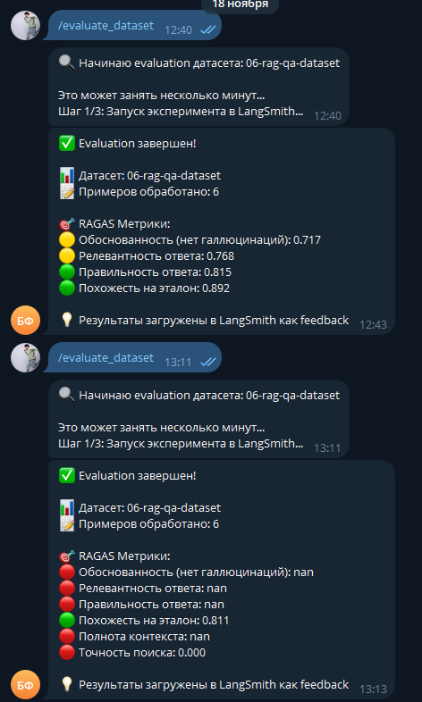

# Отчёт о выполнении задания

## Название проекта и описание

**RAG-ассистент Сбербанка** — Telegram-бот с RAG (Retrieval-Augmented Generation) для ответов на вопросы по документам Сбербанка о кредитах и вкладах.

Проект реализует систему вопросно-ответного поиска на основе документов с использованием:
- RAG на базе LangChain
- Индексации PDF и JSON документов
- Контекстного диалога с query transformation
- Автоматического синтеза тестовых датасетов
- Оценки качества через RAGAS метрики

## Вариант задания

**Базовый**

## Используемые модели и провайдеры

### Для RAG системы:
- **LLM (основная модель)**: `openai/gpt-oss-20b:free` (OpenRouter)
- **LLM (query transformation)**: `openai/gpt-oss-20b:free` (OpenRouter)
- **Embeddings**: `intfloat/multilingual-e5-base` (HuggingFace, локально)

### Для RAGAS evaluation:
- **LLM**: `openai/gpt-oss-20b:free` (OpenRouter)
- **Embeddings**: `intfloat/multilingual-e5-base` (HuggingFace, локально)

## Создание и загрузка датасета

### Способ создания датасета

Датасет создан **комбинированным способом**:
1. **Автоматический синтез из PDF** (4 примера):
   - Загружаются PDF документы из директории `data/`
   - Выбираются чанки документов (по 2 из каждого PDF файла)
   - LLM синтезирует вопросы и ответы на основе выбранных чанков
   - Используется модель из конфигурации (`openai/gpt-oss-20b:free`)

2. **Загрузка готовых Q&A пар из JSON** (2 примера):
   - Загружаются готовые вопросно-ответные пары из `sberbank_help_documents.json`
   - Выполняется случайная выборка (по 2 примера из файла)

### Размер датасета

**Всего примеров: 6**
- Синтезированных из PDF: 4
- Загруженных из JSON: 2

### Скриншот датасета в LangSmith



### Примеры Q&A пар из датасета

#### Пример 1 (синтезированный из PDF):

**Вопрос:**
```
Какие пункты содержатся в разделе I. Основные положения Общих условий предоставления, обслуживания и погашения кредитов для физических лиц по продукту "Потребительский кредит"?
```

**Ответ (ground truth):**
```
В разделе I. Основные положения перечислены четыре пункта: 1) Кредит; 2) Договор, который заключают Заемщик или Созаемщики и Кредитор (Условия Договора); 3) Стороны по Договору: Кредитор и Заемщик или Созаемщики; 4) Обеспечение по Кредиту.
```

**Источник:** `ouk_potrebitelskiy_kredit_lph.pdf`, страница 0

#### Пример 2 (из JSON):

**Вопрос:**
```
Как воспользоваться деньгами, пока мою карту перевыпускают?
```

**Ответ (ground truth):**
```
Если перевыпускаете карту без пластика, она появится в приложении СберБанк Онлайн сразу же после оформления заявки на перевыпуск. Вам будут доступны переводы и снятие наличных по QR-коду. Если перевыпускаете пластиковую карту и не хотите временно остаться без денег: Заранее переведите деньги на другую карту. Настройте оплату со SberPay, если у вас Android с функцией NFC, карта Мир и приложение СберБанк Онлайн с актуальной версией. Подключите оплату смартфоном по ссылке. Снимайте наличные с активированной карты в банкоматах по QR-коду. Снимите наличные в офисе с паспортом.
```

**Источник:** `sberbank_help_documents.json`, категория "Вопросы о дебетовых картах"

## Оценка качества через RAGAS

### Используемые метрики

Для оценки качества RAG системы используются **6 метрик RAGAS**:

1. **Faithfulness (Обоснованность)** — проверяет, что ответ не содержит галлюцинаций и основан только на retrieved документах
2. **Answer Relevancy (Релевантность ответа)** — оценивает, насколько ответ релевантен заданному вопросу
3. **Answer Correctness (Правильность ответа)** — сравнивает ответ с ground truth эталоном
4. **Answer Similarity (Похожесть на эталон)** — измеряет семантическую похожесть ответа на эталонный
5. **Context Recall (Полнота контекста)** — проверяет, содержат ли retrieved документы информацию, необходимую для правильного ответа
6. **Context Precision (Точность поиска)** — оценивает, насколько retrieved документы релевантны вопросу


