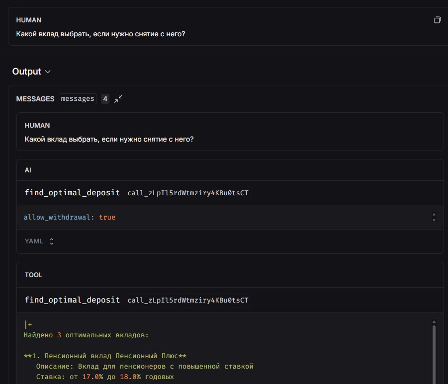
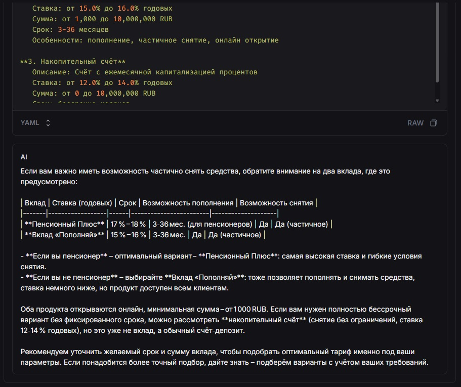

# Отчет о реализации MCP инструмента для подбора вкладов

## Какой новый инструмент мы реализовали?

Мы реализовали новый MCP (Model Context Protocol) инструмент **`find_optimal_deposit`** - интеллектуальный подбор оптимального вклада по параметрам клиента.

### Основные характеристики:

- **Название:** `find_optimal_deposit`
- **Тип:** MCP Tool (FastMCP server)
- **Назначение:** Автоматический подбор вкладов с фильтрацией по критериям и сортировкой по максимальной процентной ставке
- **Расположение:** `mcp/mcp-bank-agent/server.py`

### Параметры инструмента:

1. **`amount`** (int, опционально) - Сумма вклада для подбора
2. **`term_months`** (int, опционально) - Срок вклада в месяцах (1-240)
3. **`currency`** (Literal["RUB", "USD", "EUR"]) - Валюта вклада (по умолчанию RUB)
4. **`allow_replenishment`** (bool, опционально) - Нужна ли возможность пополнения
5. **`allow_withdrawal`** (bool, опционально) - Нужна ли возможность частичного снятия
6. **`min_rate`** (float, опционально) - Минимальная процентная ставка (0-100%)

## Как работает наш инструмент?

### Архитектура решения

Инструмент состоит из двух основных компонентов:

1. **Функция `find_optimal_deposits()`** - бизнес-логика фильтрации и сортировки
2. **MCP Tool `find_optimal_deposit()`** - асинхронный endpoint для агента

### Алгоритм работы:

```
1. Загрузка продуктов из bank_products.json
2. Фильтрация только вкладов (product_type == "deposit")
3. Применение фильтров по параметрам:
   - Валюта
   - Сумма (проверка диапазона amount_min - amount_max)
   - Срок (парсинг диапазонов вида "3-36" или "бессрочно")
   - Возможность пополнения (поиск в features)
   - Возможность снятия (поиск в features)
   - Минимальная ставка
4. Сортировка по максимальной ставке (rate_max, по убыванию)
5. Форматирование топ-5 результатов
6. Возврат отформатированной строки агенту
```

### Примеры использования

#### Пример 1: Подбор вклада по сумме и сроку

**Запрос пользователя:**
```
"Подбери вклад на 500 тысяч на год"
```

**Вызов инструмента:**
```python
find_optimal_deposit(
    amount=500000,
    term_months=12,
    currency="RUB"
)
```

**Результат:**
```
Найдено 2 оптимальных вкладов:

**1. Вклад Сохраняй**
   Описание: Вклад с максимальной ставкой без возможности пополнения
   Ставка: от 16.0% до 17.0% годовых
   Сумма: от 50,000 до 10,000,000 RUB
   Срок: 6-36 месяцев
   Особенности: максимальная ставка, онлайн открытие, автопролонгация

**2. Вклад Пополняй**
   Описание: Вклад с возможностью пополнения и частичного снятия
   Ставка: от 15.0% до 16.0% годовых
   Сумма: от 1,000 до 10,000,000 RUB
   Срок: 3-36 месяцев
   Особенности: пополнение, частичное снятие, онлайн открытие
```

#### Пример 2: Вклад с пополнением

**Запрос пользователя:**
```
"Нужен вклад с пополнением на 6 месяцев"
```

**Вызов инструмента:**
```python
find_optimal_deposit(
    term_months=6,
    allow_replenishment=True,
    currency="RUB"
)
```

**Результат:**
```
Найдено 1 оптимальных вкладов:

**1. Вклад Пополняй**
   Описание: Вклад с возможностью пополнения и частичного снятия
   Ставка: от 15.0% до 16.0% годовых
   Сумма: от 1,000 до 10,000,000 RUB
   Срок: 3-36 месяцев
   Особенности: пополнение, частичное снятие, онлайн открытие
```

#### Пример 3: Вклад с минимальной ставкой

**Запрос пользователя:**
```
"Вклад минимум 15% годовых"
```

**Вызов инструмента:**
```python
find_optimal_deposit(
    min_rate=15.0,
    currency="RUB"
)
```

**Результат:**
```
Найдено 4 оптимальных вкладов:

**1. Пенсионный вклад Пенсионный Плюс**
   Описание: Вклад для пенсионеров с повышенной ставкой
   Ставка: от 17.0% до 18.0% годовых
   ...

**2. Вклад Сохраняй**
   Ставка: от 16.0% до 17.0% годовых
   ...

**3. Вклад Пополняй**
   Ставка: от 15.0% до 16.0% годовых
   ...
```

### Интеграция с агентом

Инструмент автоматически подключается к ReAct агенту через MCP клиент:

```python
# В src/agent.py
mcp_tools = await mcp_client.get_tools()
tools.extend(mcp_tools)  # find_optimal_deposit автоматически добавляется
```

Агент получает описание инструмента через MCP протокол и использует его на основе системного промпта (`prompts/agent_system.txt`).

## Какие преимущества MCP мы заметили?

### 1. **Автоматическое обнаружение инструментов**

MCP сервер автоматически регистрирует все инструменты с декоратором `@mcp.tool()`, и они становятся доступны агенту без дополнительной конфигурации:

```python
@mcp.tool(
    name="find_optimal_deposit",
    description="Подбор оптимального вклада..."
)
async def find_optimal_deposit(...):
    ...
```

Агент получает список инструментов через `mcp_client.get_tools()` и может их использовать сразу.

### 2. **Стандартизированный протокол**

MCP предоставляет единый интерфейс для подключения инструментов:
- Единый формат описания (name, description, parameters)
- Автоматическая валидация параметров через Pydantic
- Типизация через Annotated и Field

### 3. **Разделение ответственности**

MCP позволяет разделить логику:
- **MCP Server** (`mcp/mcp-bank-agent/server.py`) - бизнес-логика инструментов
- **Agent** (`src/agent.py`) - стратегия использования инструментов
- **Data** (`mcp/mcp-bank-agent/data/bank_products.json`) - данные продуктов

Это упрощает поддержку и тестирование.

### 4. **Гибкость транспорта**

MCP поддерживает разные транспорты:
- **streamable-http** - HTTP сервер (используем)
- **stdio** - стандартный ввод/вывод
- **SSE** - Server-Sent Events

Мы используем `streamable-http`, что позволяет запускать MCP сервер как отдельный HTTP сервис.

### 5. **Асинхронная архитектура**

Все MCP инструменты асинхронные (`async def`), что позволяет:
- Параллельную обработку запросов
- Неблокирующие вызовы внешних API
- Эффективное использование ресурсов

### 6. **Простое добавление новых инструментов**

Добавление нового инструмента требует только:
1. Создать функцию с декоратором `@mcp.tool()`
2. Обновить системный промпт агента (опционально, для лучшего понимания)
3. Перезапустить сервер

Не нужно изменять код агента или конфигурацию.

## С какими сложностями столкнулись?

### 1. **Необходимость обновления системного промпта**

**Проблема:** 
Агент автоматически получает все MCP инструменты, но не всегда понимает, когда их использовать, если в системном промпте нет явных инструкций.

**Решение:**
Добавили описание `find_optimal_deposit` в `prompts/agent_system.txt` с примерами использования:
```
КОГДА ИСПОЛЬЗОВАТЬ find_optimal_deposit:
- "Подбери вклад на 500 тысяч на год" → find_optimal_deposit(amount=500000, term_months=12)
- "Нужен вклад с пополнением на 6 месяцев" → find_optimal_deposit(term_months=6, allow_replenishment=True)
```

**Вывод:** MCP автоматизирует подключение инструментов, но промпт-инжиниринг все еще важен для правильного использования.

### 2. **Парсинг строковых диапазонов сроков**

**Проблема:**
В `bank_products.json` сроки хранятся в разных форматах:
- `"3-36"` - диапазон
- `"бессрочно"` - специальное значение
- `"12"` - одно значение

**Решение:**
Реализовали парсер с обработкой всех случаев:
```python
if term_str == 'бессрочно':
    filtered_by_term.append(d)
elif '-' in term_str:
    # Парсинг диапазона "3-36"
    min_term, max_term = map(int, term_str.split('-'))
    if min_term <= term_months <= max_term:
        filtered_by_term.append(d)
```

**Вывод:** Нужна нормализация данных или более строгая схема валидации.

### 3. **Фильтрация по features (текстовый поиск)**

**Проблема:**
Фильтрация по возможности пополнения/снятия основана на текстовом поиске в массиве `features`:
```python
'пополнение' in ' '.join(d.get('features', [])).lower()
```

Это хрупко - если изменится формулировка в данных, фильтр может сломаться.

**Решение:**
Используем текстовый поиск с обработкой разных вариантов:
```python
any(word in ' '.join(d.get('features', [])).lower() 
    for word in ['снятие', 'частичное снятие'])
```

**Вывод:** Лучше использовать структурированные boolean поля в данных или enum для features.

### 4. **Отладка MCP инструментов**

**Проблема:**
Когда инструмент не вызывается агентом, сложно понять причину:
- Проблема в описании инструмента?
- Проблема в промпте?
- Проблема в логике агента?

**Решение:**
Добавили детальное логирование:
```python
logger.info(f"find_optimal_deposit called: amount={amount}, term={term_months}, ...")
```

И проверку подключения в агенте:
```python
logger.info(f"✓ Connected to MCP server, loaded {len(mcp_tools)} tools:")
for tool in mcp_tools:
    logger.info(f"  - {tool.name}: {tool.description}")
```

**Вывод:** Необходимо хорошее логирование на всех уровнях (MCP server, agent, client).

### 5. **Синхронизация версий**

**Проблема:**
При изменении MCP сервера нужно:
1. Перезапустить MCP сервер
2. Перезапустить агента (чтобы переподключиться)
3. Обновить промпт (если изменилось описание)

**Решение:**
Используем отдельные процессы для MCP сервера и агента, что упрощает перезапуск.

**Вывод:** Нужна автоматизация развертывания или hot-reload для разработки.

## Скриншоты



*Пример работы агента с новым инструментом: подбор вклада на 500 тысяч рублей на 12 месяцев*



*Результаты работы инструмента: топ-5 оптимальных вкладов, отсортированных по максимальной ставке*

## Выводы

Реализация `find_optimal_deposit` показала, что MCP - это мощный протокол для создания модульных AI-агентов:

✅ **Преимущества:**
- Автоматическое обнаружение и подключение инструментов
- Стандартизированный интерфейс
- Разделение ответственности
- Простота добавления новых инструментов

⚠️ **Сложности:**
- Необходимость промпт-инжиниринга для правильного использования
- Нормализация данных для надежной фильтрации
- Отладка распределенной системы (MCP server + Agent)

🎯 **Рекомендации:**
- Использовать структурированные данные вместо текстового поиска
- Добавлять детальное логирование на всех уровнях
- Документировать инструменты в системном промпте с примерами
- Рассмотреть автоматизацию развертывания для production

